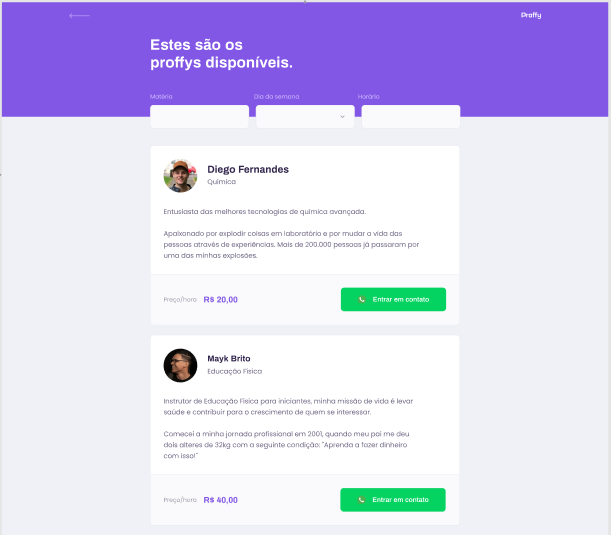

<h1 align="center">
    
    

</h1>

  <a href="#rocket-tecnologias">Tecnologias</a>&nbsp;&nbsp;&nbsp;|&nbsp;&nbsp;&nbsp;
  <a href="#-projeto">Projeto</a>&nbsp;&nbsp;&nbsp;|&nbsp;&nbsp;&nbsp;
  <a href="#-layout">Layout</a>&nbsp;&nbsp;&nbsp;|&nbsp;&nbsp;&nbsp;
  <a href="#-como-contribuir">Como contribuir</a>&nbsp;&nbsp;&nbsp;|&nbsp;&nbsp;&nbsp;
  <a href="#memo-licença">Licença</a>

 

  

 

## 🚀 Tecnologias

Esse projeto foi desenvolvido com as seguintes tecnologias:

- [Node.js](https://nodejs.org/en/)
- [React](https://reactjs.org)
- [React Native](https://facebook.github.io/react-native/)
- [Expo](https://expo.io/)

## 💻 Projeto

Proffy - é uma platafoma que visa conectar professores e estudantes de uma maneira inteligente,
dando a oportunidade de encontrar a aula perfeita para a sua necessidade e também o aluno que tanto precisa do professor.

Os professores poderão se cadastrar na plataforma web enviando:
- uma imagem sua.
- nome, matéria que leciona, whatsapp e valor cobrado por hora.
- além de selecionar quais dias da semana e horários ele tem disponívei para dar aula: 

Os alunos terão acesso a quais professores estão disponíveis nos horários que de sua preferência, onde poderão:
- entrar em contato com o professor de sua preferência
- Adicionalo a sua lista de professores favoritos.

Projeto desenvolvido durante a **NLW#2 - Next Level Week** oferecida pela [Rocketseat](rs).
O NLW é uma experiência online com muito conteúdo prático, desafios e hacks onde o conteúdo fica disponível durante uma semana.

## 🔖 Layout

Você pode visualizar o layout do projeto no formato através [desse link](https://www.figma.com/file/GHGS126t7WYjnPZdRKChJF/?viewer=1&node-id=). Lembrando que você irá precisar ter uma conta no [Figma](http://figma.com/).

## 🤔 Como contribuir

- Faça um fork desse repositório;
- Cria uma branch com a sua feature: `git checkout -b minha-feature`;
- Faça commit das suas alterações: `git commit -m 'feat: Minha nova feature'`;
- Faça push para a sua branch: `git push origin minha-feature`.

Depois que o merge da sua pull request for feito, você pode deletar a sua branch.

## :memo: Licença

Esse projeto está sob a licença MIT.

---

Feito com ♥ by EvertonBruce :wave: [Entre em contato!](http://www.linkedin.com/in/everton-nascimento-de-oliveira)
